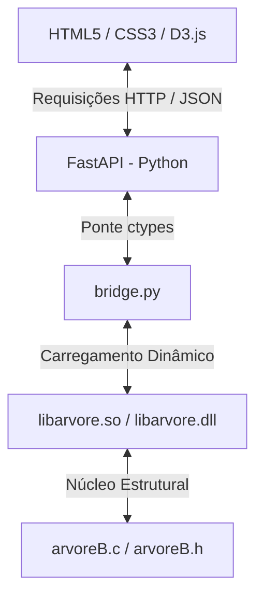

# 🌳 Árvore B+

Este projeto é um **Visualizador Interativo de Árvore B+** que combina o poder e eficiência do **C** (núcleo da estrutura de dados) com a flexibilidade do **Python/FastAPI** (servidor e ponte ctypes) e a elegância de uma interface web moderna renderizada com **D3.js**.

A interface conta com um design moderno (*Dark Mode* e *Glassmorphism*) e recursos de interatividade como **Zoom & Pan**, **Console de Histórico** em tempo real, **Realce Neon** nas chaves buscadas e a **visualização física do encadeamento das folhas** (o ponteiro `prox` que liga as folhas em sequência).

---

## 📐 Arquitetura do Projeto

O fluxo de dados do visualizador opera em quatro camadas integradas:



1. **Interface do Usuário (Frontend)**: Construída com D3.js para desenhar a árvore graficamente através de SVG dinâmico, suportando transições de inserção/remoção de nós e zoom/pan.
2. **Servidor API (Backend)**: FastAPI que expõe rotas para comunicação direta e manipulação do ponteiro da árvore mantido na memória do servidor.
3. **Ponte ctypes (Integração)**: Traduz estruturas de dados do Python para tipos C equivalentes, permitindo a comunicação nativa.
4. **Núcleo em C**: Contém a lógica clássica da Árvore B+, gerenciando inserções (com *splits* de folha e nós internos), remoções (tratamento de *underflows*, redistribuições e fusões), buscas e buscas por intervalo.

---

## ✨ Funcionalidades em Destaque

*   🎨 **Design Premium**: Visual *Dark Mode* elegante com paleta de cores balanceada, cantos arredondados nos nós e tipografia moderna (*Plus Jakarta Sans*).
*   🚀 **Visualização da Lista Encadeada**: Setas tracejadas conectando os nós folha adjacentes na base da árvore, demonstrando a característica essencial da Árvore B+ para buscas por intervalo.
*   🔍 **Busca Passo a Passo com Efeito Glow**: O nó que contém a chave buscada é destacado com um brilho pulsante neon na cor ciano.
*   ⚙️ **Terminal de Histórico**: Um console interno simulado na barra lateral exibe todas as ações realizadas com data e hora.
*   🗺️ **Zoom & Pan**: Arraste a tela e use o scroll do mouse para explorar a árvore facilmente à medida que ela cresce.

---

## 📋 Pré-requisitos

Para rodar este projeto localmente, você precisará ter instalado:

1.  **Python 3.x**
2.  **GCC** (ou o ambiente **WSL** instalado no Windows com GCC)
3.  Bibliotecas Python necessárias (instale pelo terminal):
    ```bash
    pip install fastapi uvicorn
    ```

---

## 🚀 Como Executar o Projeto

### Passo 1: Compilar a Biblioteca C

É necessário compilar o código em C para gerar uma biblioteca dinâmica (`.so` para Linux/WSL ou `.dll` para Windows nativo).

*   **No Linux ou WSL (Recomendado se estiver no Windows sem GCC nativo):**
    ```bash
    gcc -shared -fPIC -o libarvore.so arvoreB.c
    ```
*   **No Windows nativo (usando MinGW):**
    ```bash
    gcc -shared -o libarvore.dll arvoreB.c
    ```

---

### Passo 2: Iniciar a API FastAPI

Abra o seu terminal na pasta do projeto e inicie o servidor local:

*   **Executando diretamente pelo terminal do Windows / Linux nativo:**
    ```bash
    python -m uvicorn api:app --reload
    ```
*   **Executando no Windows direcionando para o WSL (caso tenha compilado em Linux/WSL):**
    ```bash
    wsl python3 -m uvicorn api:app --host 127.0.0.1 --port 8000
    ```

Quando iniciado, o terminal exibirá:
`INFO: Uvicorn running on http://127.0.0.1:8000`

---

### Passo 3: Interagir com o Visualizador

1.  Abra o arquivo `index.html` diretamente em seu navegador (dando dois cliques nele pelo Explorador de Arquivos ou abrindo pelo VS Code através da extensão **Live Server**).
2.  Observe no canto superior direito: o status de conexão deve mostrar **"API Online" (verde)**.
3.  Insira, remova ou busque números usando os botões na barra lateral!

---

## ⚙️ Configurações da Árvore B+

A estrutura C está configurada com as seguintes diretivas de compilação em `arvoreB.h`:

*   **Grau Interno ($P$ = 3)**: Indica que um nó interno pode ter no máximo 2 chaves e no mínimo 1 (exceto a raiz).
*   **Grau Folha ($PFolha$ = 2)**: Indica que um nó folha pode ter no máximo 2 chaves e no mínimo 1.

---

## 📂 Estrutura de Arquivos

*   `arvoreB.h` / `arvoreB.c`: Código estrutural da árvore em C.
*   `main.c`: Menu de testes interativo executado diretamente no terminal (C puro).
*   `bridge.py`: Mapeador `ctypes` e carregador da biblioteca compilada.
*   `api.py`: API RESTful usando FastAPI.
*   `teste_integracao.py`: Script Python para validação rápida da ponte de integração.
*   `index.html`: Interface web e roteamento D3.js.
